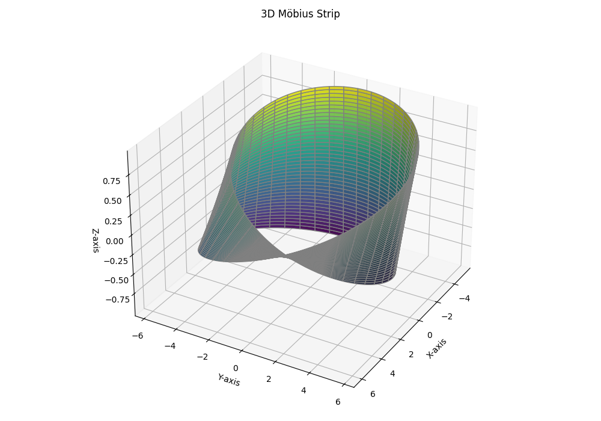

# Mobius Strip Surface Area Approximation & Visualization 

## Overview
This project generates a 3D Mobius strip using parametric equations, approximates its surface area numerically, computes its edge length, and visualizes it interactively in 3D using Matplotlib.

---

## Code Structure

I structured the project as a Python class, `MobiusStrip`, to logically group related functionalities together. Here's how it’s organized:

- **`__init__`**: Initializes parameters and precomputes the meshgrid for efficiency.
- **`generate_mesh()`**: Computes 3D coordinates based on the Möbius strip’s parametric equations.
- **`compute_surface_area()`**: Approximates surface area using a discrete double integral via finite differences.
- **`compute_edge_length()`**: Numerically estimates total edge length by summing Euclidean distances between boundary points.
- **`plot()`**: Plots the 3D Möbius strip using Matplotlib. Optionally applies a colormap for better depth perception.

I opted to precompute the meshgrid during initialization so that it can be reused across methods without redundant computation. This makes the code cleaner, faster, and easier to maintain.

---

## How Surface Area is Approximated

The surface area is approximated using the double integral formula:

A = ∬ |∂r/∂u × ∂r/∂v| du dv

Since we’re working numerically, I discretized the parameter space into a grid and computed the partial derivatives analytically, then calculated the cross product magnitudes over the mesh. The total surface area is then approximated by summing these local areas and multiplying by the small area element \(Δu x Δv).

Surface Area ≈ ΣΣ |∂r/∂u x ∂r/∂v| x (Δu x Δv)

This method balances accuracy and computational cost well for a 3D shape like the Möbius strip.

---

## Challenges Faced

- **Parametric Derivatives:** One tricky part was carefully deriving and simplifying the partial derivatives for the Mobius strip’s parametric equation. A small mistake in differentiation caused distorted plots initially.
- **Edge Length Calculation:** Because a Mobius strip only has one continuous edge, it wasn’t obvious at first how to approach this numerically. I ended up computing the lengths along both parameter boundaries (v = ±w/2) and summing them, which gave a reasonable approximation.
- **Plot Aesthetics:** Balancing a clean, professional look with depth perception in the 3D plot was another minor challenge. I eventually added an optional colormap (`viridis`) to improve depth cues while keeping `cornflowerblue` as a clean default.

---

## 3D Visualization Result

Here’s an example of the rendered Mobius strip using the `viridis` colormap for better depth perception:



---

## Dependencies

This project requires the following Python libraries:

- **numpy**
- **matplotlib**

You can install them using:

```bash
pip install -r requirements.txt

```

## How to Run

```bash
python mobius_strip.py
```

## Approximate Results

Note: Since no real-world units were defined for R or w, let's consider centimeters (cm).

Let's consider example parameter inputs as R=5, w=2, n=200. And the results are:-

Surface Area: 63.573 cm²

Edge Length: 67.149 cm
